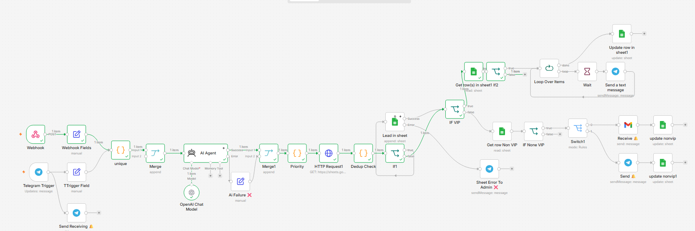

<p align="center">
  
</p>

<h1 align="center">AI Lead Automation System</h1>

<p align="center">
  <strong>Self-healing, event-driven lead management engine — built with n8n.</strong>
</p>

<p align="center">
  <a href="LICENSE"></a>
  
  
  
  
</p>

---

## 📌 What is this?

A complete, production-grade system that captures leads from **Web** and **Telegram**, scores them with **AI**, prevents duplicates via **deterministic idempotency**, routes **VIP leads** to an admin approval flow with interactive Telegram buttons, and **self-heals** missed notifications through a time‑aware background sweeper.

---

## 📸 See it in action

<p align="center">
  
  
  
  
  
  
  
</p>

<p align="center">
  
</p>

---

## 💼 Business Value

| Problem | Solution |
| :--- | :--- |
| **Duplicate leads from retries** | Deterministic unique ID + API lookup |
| **Missed notifications (crash/downtime)** | Background sweeper recovers stuck leads |
| **API failures block the pipeline** | Fault-tolerant AI & Sheets with fallbacks |
| **No human oversight for VIP leads** | Telegram inline approval workflow |
| **Leads from multiple channels** | Unified Webhook + Telegram ingestion |
| **Unclear notification status** | Stateful flags (`email_sent`, etc.) |

---

## 🧠 Core Engineering Principles

- **Deterministic Idempotency:** Content‑based hash + Google Sheets API dedup.
- **Exactly‑Once Delivery:** Stateful flags guard every notification.
- **Race‑Condition Mitigation:** Sweeper respects a 10‑minute `created_at` threshold.
- **Fault‑Tolerant AI:** On failure, pipeline continues with `lead_score = -1`.
- **Human‑in‑the‑Loop UX:** Inline buttons removed after admin decision.

---

## 🏗️ Architecture

```text
                        +-------------------+          +---------------------+
                        |   Webhook (Site)  |          |   Telegram Trigger  |
                        +---------+---------+          +----------+----------+
                                  |                               |         |
                                  |                               |         +-----------------------+
                                  |                               |                                 |
                                  v                               v                                 v
                        +---------+---------+          +--------+--------+              +---------+---------+
                        | Set Field         |          | Set Field       |              | Send Message      |
                        | (Webhook)         |          | (Telegram)      |              | (Receipt to User) |
                        +---------+---------+          +---------+--------+              +-------------------+
                                  |                               |
                                  +-------------+-----------------+
                                                |
                                                v
                                        +-------+-------+
                                        | Code Node     |
                                        | (unique_id)   |
                                        +-------+-------+
                                                |
                                                v
                                        +-------+-------+
                                        |    Merge      |
                                        +-------+-------+
                                                |
                                                v
                                        +-------+-------+
                                        |   AI Agent    |
                                        +---+------+----+
                                            |      |
                                 success    |      |  error / fallback
                                            |      v
                                            |  +---+---+
                                            |  |  AI   |
                                            |  |Failure|
                                            |  +---+---+
                                            |      |
                                            v      v
                                        +---+------+---+
                                        |    Merge1    |
                                        +------+-------+
                                               |
                                               v
                                        +------+-------+
                                        | Code Node    |
                                        | (Priority)   |
                                        +------+-------+
                                               |
                                               v
                                        +------+-------+
                                        |  Get Rows    |
                                        +------+-------+
                                               |
                                               v
                                        +------+-------+
                                        | Code Node    |
                                        | (Dedup Check)|
                                        +------+-------+
                                               |
                                               v
                                        +------+-------+
                                        |    IF1 (New?)|
                                        +---+------+----+
                                            |      |
                                   True     |      | False
                             +--------------+      +-----------------+
                             |                                       |
                             v                                       v
                   +---------+---------+                   +---------+---------+
                   |   Append Row      |                   |   IF VIP        |
                   |  (Lead in Sheet)  |                   | (budget>10k or  |
                   +---+-----------+---+                   |  score>80)      |
                       |           |                       +-----+---+----+----+
               success |           | error                       |        |
                       |           v                             |        |
                       |    +------+-----------+            True  |        |  False
                       |    | Send Message to  |                  |        |
                       |    | Admin (Error)    |                  |        |
                       |    +------------------+                  |        |
                       |                                          |        |
                       v                                          v        v
             +---------+---------+ -------True ---------> +---------+--+   +--+---------+
             |   IF VIP        |                          | Get Row VIP|   | Get Row    |
             | (budget>10k or  |                          +------+-----+   | Non-VIP    |
             |  score>80)      |-------False --------------  | --------> +------+-----+
             +-----+---+----+----+                               |                  |   
                                                                 v                  v
                                                      +---------+--+        +----+--------+
                                                      | IF2        |        | IF Non-VIP  |
                                                      | (telegram_ |        | (email_sent |
                                                      | notified=  |        | = empty?)   |
                                                      | "empty"?)  |        +------+------+
                                                      +------+------+               |
                                                             |                Yes   |   No
                                                    Yes      |   No                 |      (stop)
                                                 +-----------+  (stop)              |
                                                 |                                +-v-+
                                                 v                                |Switch (source)|
                                        +--------+--------+                       +-+-----+-----+
                                        | Loop Over Items |                         |     |
                                        +--------+--------+                       Site   Telegram
                                                 |                                  |     |
                                          +--------v--------+             +---------v-+ +-v---------+
                                          | Wait (Rate Limit)|            | Gmail     | | Telegram  |
                                          +--------+--------+             +------+----+ +-----+-----+
                                                   |                             |              |
                                          +--------v--------+             +------v----+   +-----v-----+
                                          | Send Telegram   |             | Update Row|   | Update Row |
                                          | (Admin, Inline  |             | (email_   |   | (email_    |
                                          | Keyboard)       |             | sent)     |   | sent)      |
                                          +--------+--------+             +-----------+   +-----------+
                                                   |
                                          +--------v--------+
                                          | Update Row      |
                                          | (telegram_notif)|
                                          +-----------------+


===================== CALLBACK & ADMIN UI =====================

                    +---------------------------+
                    | Telegram Trigger1         |
                    | (Callback Query)          |
                    +-----------+---------------+
                                |
                  +-------------+-------------+
                  |                           |
     +------------v-----------+    +----------v---------------+
     | HTTP Request           |    | Answer Callback Query    |
     | (editMessageReplyMarkup)|    +----------+---------------+
     +------------+-----------+               |
                  |             +-------------v-------------+
     +------------v-----------+ | Update Row (status)        |
     | Edit Message Text      | +-------------+-------------+
     +-------------------------+               |
                                +-------------v-------------+
                                | Get Row (lookup)          |
                                +-------------+-------------+
                                              |
                                +-------------v-------------+
                                | IF Approved               |
                                | (status = Approved &      |
                                | welcome_email_sent = empty)|
                                +------+--------------------+
                                       |
                               Yes     |      No (stop)
                                       v
                               +-------+--------+
                               | Switch (source) |
                               +--+------------+-+
                                  |            |
                                Site        Telegram
                                  |            |
                         +--------v--+     +---v--------+
                         | Gmail     |     | Telegram   |
                         +--------+--+     +---+--------+
                                  |            |
                         +--------v--+     +-----v------+
                         | Update Row |     | Update Row |
                         | (welcome_  |     | (welcome_  |
                         | email_sent)|     | email_sent)|
                         +-----------+     +------------+

===================== PART 3: SWEEPER (SELF-HEALING) =====================

          +---------------------------+
          | Schedule Trigger          |
          | (Every 5 Minutes)         |
          +-----------+---------------+
                      |
          +-----------v---------------+
          | HTTP Request (Sheets API) |
          | Read entire sheet         |
          +-----------+---------------+
                      |
          +-----------v---------------+
          | Code Node (Filter &       |
          | Decide)                   |
          |                           |
          | Rules:                    |
          | • Skip if created_at      |
          |   < 10 min ago            |
          | • Non-VIP + email_sent    |
          |   = empty → send_email    |
          | • VIP + telegram_notif    |
          |   = empty → send_telegram |
          | • VIP + status = pending  |
          |   + telegram_notif older  |
          |   than 10 min →           |
          |   send_telegram (remind)  |
          | • Approved + welcome_sent |
          |   = empty → send_welcome  |
          +-----------+---------------+
                      |
          +-----------v---------------+
          | Loop Over Items           |
          +-----------+---------------+
                      |
          +-----------v---------------+
          | Switch (3 Outputs)        |
          +--+----+----+--------------+
             |         |              |
send_email   |         |              send_welcome
+--------+----+        |              +--------+--------+ 
|   Gmail     |    send_telegram      |        Gmail    |
+--------+----+        |              +--------+--------+
                       |                       |
       |         +--------+--------+           |
+------+------+  | Send Telegram   |  +--------+--------+ 
|  Update Row |  | (Admin, Inline  |  |   Update Row   |
|   email sent|  | Keyboard)       |  |  welcome sent  |
+----+--------+  +--------+--------+  +--------+--------+
                          |
                 +--------+--------+
                 | Update Row      |
                 | (telegram_notif)|
                 +-----------------+
```

---

## 🛠️ Technologies

| Layer | Stack |
| :--- | :--- |
| **Automation** | `n8n (Docker)` |
| **AI Processing** | `OpenAI API` / Compatible LLM |
| **Database** | `Google Sheets (REST API)` |
| **Messaging** | `Telegram Bot API` |
| **Email Service** | `Gmail API` |
| **Tunneling** | `Serveo` / `Ngrok` |

---

## 🚀 Quick Start

1. Import workflow JSONs into **n8n**.
2. Set up Google, Telegram, and OpenAI credentials.
3. Expose your webhook URL via tunnel (e.g., Serveo).
4. Create a Google Sheet with the required schema/columns.
5. Activate the workflows: `Main`, `Sweeper`, and `Error Watcher`.

---

## 📁 Workflow Files

- `main_workflow.json` – Core pipeline & admin callback interface.
- `sweeper_workflow.json` – Scheduled background recovery engine.
- `error_watcher.json` – Global error handling & alerts.

---

## 📄 License

This project is licensed under the [MIT License](LICENSE).

---

<p align="center">
  <b>Built with logic & precision by F22mation</b><br>
  <a href="https://github.com/f22mation">GitHub</a> · 
  <a href="https://linkedin.com/in/f22mation">LinkedIn</a> · 
  <a href="mailto:f22mation@gmail.com">Email</a>
</p>
